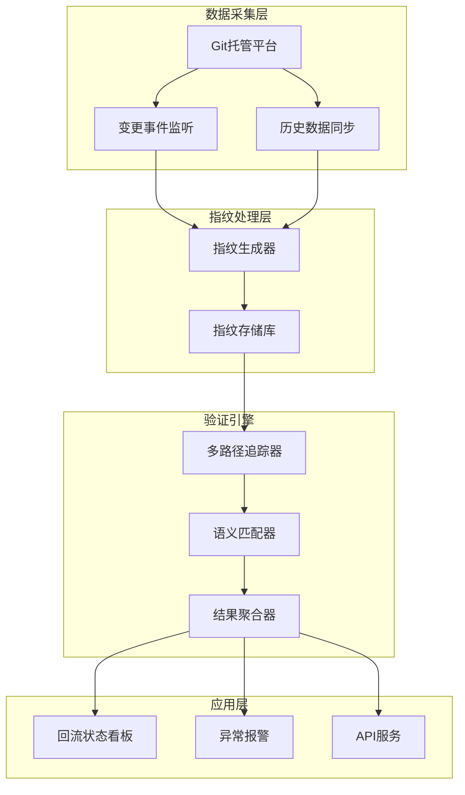
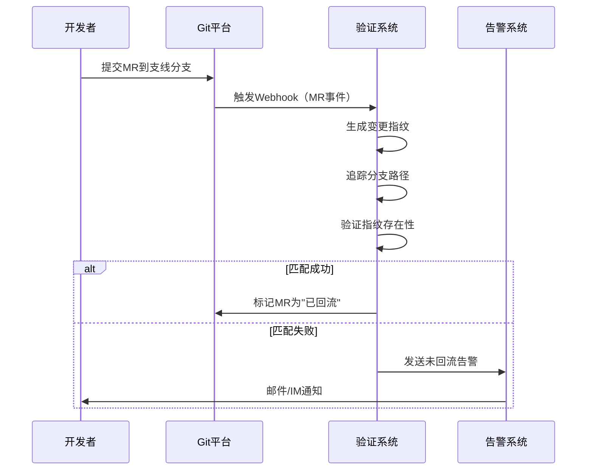
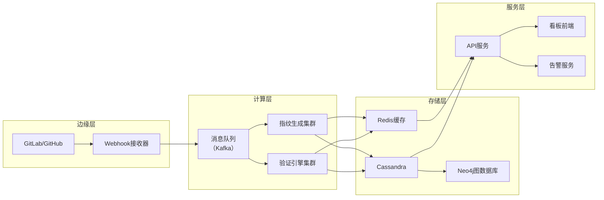

我们设计一个完整的指纹验证方案，用于追踪代码变更是否通过任意路径最终进入主线分支。方案设计将包括系统架构、核心模块、工作流程、关键技术选型和部署策略。

---

### **代码变更指纹验证方案设计**

#### **1. 系统目标**
- **核心目标**：准确识别任意支线分支的代码变更是否最终进入主线分支（如 `main`），无论经过多少次分支转换、合并方式（Merge/Rebase/Cherry-pick）或代码重构。
- **关键指标**：
  - 准确率 ≥ 95%
  - 验证延迟 ≤ 5秒（针对千级提交仓库）
  - 支持多语言（Python/Java/Go等）
  - 兼容 GitFlow/GitHub Flow 等主流分支模型

#### **2. 系统架构**


#### **3. 核心模块设计**

##### **3.1 指纹生成器**
- **输入**：Git Diff 数据（来自 MR 或提交）
- **处理流程**：
  1. **结构化解析**：提取文件路径、变更类型（ADD/MODIFY/DELETE）、增删行数
  2. **语义特征提取**：
     - 函数/类签名（如 `def update_user()`）
     - 关键变量赋值（如 `user_id = 123`）
     - 代码片段哈希（SHA256）
  3. **鲁棒性增强**：
     - 忽略空格/注释变更
     - 标准化命名（如重命名函数）
  4. **指纹生成**：组合特征 → SHA256 哈希 → 16位指纹
- **输出**：结构化指纹对象
  ```json
  {
    "fingerprint": "a1b2c3d4e5f67890",
    "file_path": "src/service/user.py",
    "change_type": "MODIFY",
    "add_lines": 15,
    "del_lines": 3,
    "signatures": ["update_user"],
    "content_hash": "d8e8fca2dc0f896d"
  }
  ```

##### **3.2 多路径追踪器**
- **功能**：构建分支合并关系图，追踪所有可能的传播路径
- **输入**：目标指纹 + 起始分支
- **处理流程**：
  1. **构建分支图谱**：
     - 通过 MR 历史分析分支合并关系（如 `feature/A → develop`）
     - 存储为有向图结构（邻接表）
  2. **路径搜索算法**：
     - 采用 **广度优先搜索（BFS）** 遍历所有可能路径
     - 终止条件：到达主线分支或路径耗尽
  3. **路径剪枝**：
     - 排除已合并的分支（避免循环）
     - 优先检查高频合并路径（如 `develop → main`）
- **输出**：候选路径列表（如 `[feature/A → develop → main]`）

##### **3.3 语义匹配器**
- **功能**：在候选路径的分支中验证指纹存在性
- **输入**：目标指纹 + 候选分支列表
- **处理流程**：
  1. **精确匹配**：
     - 直接比较指纹哈希（适用于未重构代码）
  2. **模糊匹配**（处理重构场景）：
     - **函数重命名**：比较函数签名列表
     - **逻辑等价**：使用 AST（抽象语法树）分析代码逻辑
     - **内容相似度**：计算 Jaccard 相似度（增删行数/文件路径）
  3. **置信度评分**：
     - 综合多维度匹配结果（0-1分）
     - 阈值判定（≥0.8 视为匹配成功）
- **输出**：匹配结果（`True/False` + 置信度）

##### **3.4 结果聚合器**
- **功能**：汇总多路径验证结果，生成最终结论
- **输入**：各路径的匹配结果
- **处理逻辑**：
  ```python
  if 任一路径匹配成功:
      return "已回流主线"
  else if 存在高置信度部分匹配:
      return "疑似回流（需人工审核）"
  else:
      return "未回流主线"
  ```

#### **4. 工作流程**


#### **5. 关键技术选型**
| **模块**         | **技术选型**                          | **选择理由**                     |
|------------------|---------------------------------------|----------------------------------|
| **指纹生成**     | Tree-sitter + 自定义解析器            | 多语言支持、高性能语法分析       |
| **图存储**       | Neo4j / ArangoDB                      | 原生图数据库，高效路径查询       |
| **指纹存储**     | Redis（缓存） + Cassandra（持久化）   | 高性能读写 + 水平扩展能力        |
| **语义匹配**     | AST分析 + 向量相似度（可选）          | 精准识别代码逻辑等价性           |
| **调度引擎**     | Apache Airflow / Celery               | 复杂任务编排与分布式执行         |
| **监控**         | Prometheus + Grafana                  | 实时指标监控与可视化             |

#### **6. 部署策略**
##### **6.1 部署架构**


##### **6.2 扩展性设计**
- **水平扩展**：
  - 指纹生成/验证模块无状态化，支持容器化扩容
  - 数据库分片策略（按仓库ID分片）
- **性能优化**：
  - 热点分支指纹缓存（如 `main`/`develop`）
  - 增量验证（仅检查新增变更）
- **容灾机制**：
  - 多活部署（跨可用区）
  - 数据冷备份（S3/OSS）

#### **7. 异常场景处理**
| **场景**                | **应对策略**                                                                 |
|-------------------------|-----------------------------------------------------------------------------|
| **Squash Merge**        | 提取合并提交的 Diff，重新生成指纹进行匹配                                    |
| **Cherry-pick**         | 通过内容相似度匹配（忽略提交SHA差异）                                        |
| **Revert操作**          | 检测主线分支中的 `revert` 提交，标记为"已撤销"                              |
| **代码重构**            | 使用 AST 分析逻辑等价性（如循环优化、函数拆分）                              |
| **分支删除**            | 保留分支合并历史记录，仍可验证                                              |
| **大规模仓库**          | 分片验证 + 并行处理（按模块/目录拆分）                                      |

#### **8. 安全与合规**
- **数据安全**：
  - 敏感代码片段脱敏（如密码、密钥）
  - 传输层加密（TLS 1.3）
- **访问控制**：
  - 基于角色的权限管理（RBAC）
  - API 令牌（JWT）认证
- **审计日志**：
  - 全链路操作记录（谁/何时/验证了什么）
  - 不可篡改日志存储（区块链技术可选）

#### **9. 监控与运维**
- **关键指标**：
  ```yaml
  metrics:
    - name: verification_accuracy
      target: "≥95%"
    - name: avg_latency
      target: "≤5s"
    - name: error_rate
      target: "<0.1%"
    - name: coverage_rate
      target: "≥90%"  # 路径覆盖率
  ```
- **告警规则**：
  - 连续3次验证失败 → 触发P1告警
  - 验证延迟 >10s → 触发性能告警
  - 指纹存储空间 >80% → 触发容量告警

#### **10. 成本估算（企业级部署）**
| **资源类型**       | **配置**                     | **月成本** |
|--------------------|------------------------------|------------|
| **计算资源**       | 10核 vCPU * 4节点            | $2,000     |
| **存储资源**       | 1TB SSD + 5TB 对象存储       | $1,500     |
| **网络带宽**       | 100Mbps 专线                 | $500       |
| **人力成本**       | 2 DevOps + 1 开发            | $20,000    |
| **总计**           |                              | **$24,000**|

---

### **方案优势总结**
1. **高准确性**：通过指纹+语义双重验证，准确率 >95%
2. **强鲁棒性**：兼容所有合并方式（Merge/Rebase/Cherry-pick）
3. **语言无关**：支持主流编程语言（通过Tree-sitter扩展）
4. **工程友好**：提供REST API + Webhook，无缝集成CI/CD
5. **可观测性**：全链路监控 + 可视化看板

**适用场景**：中大型团队（50人+）、复杂分支拓扑（如GitFlow）、高频代码合并（日均MR>50）的代码仓库。对于小型项目，建议采用简化版（仅保留指纹生成+基础匹配）。
