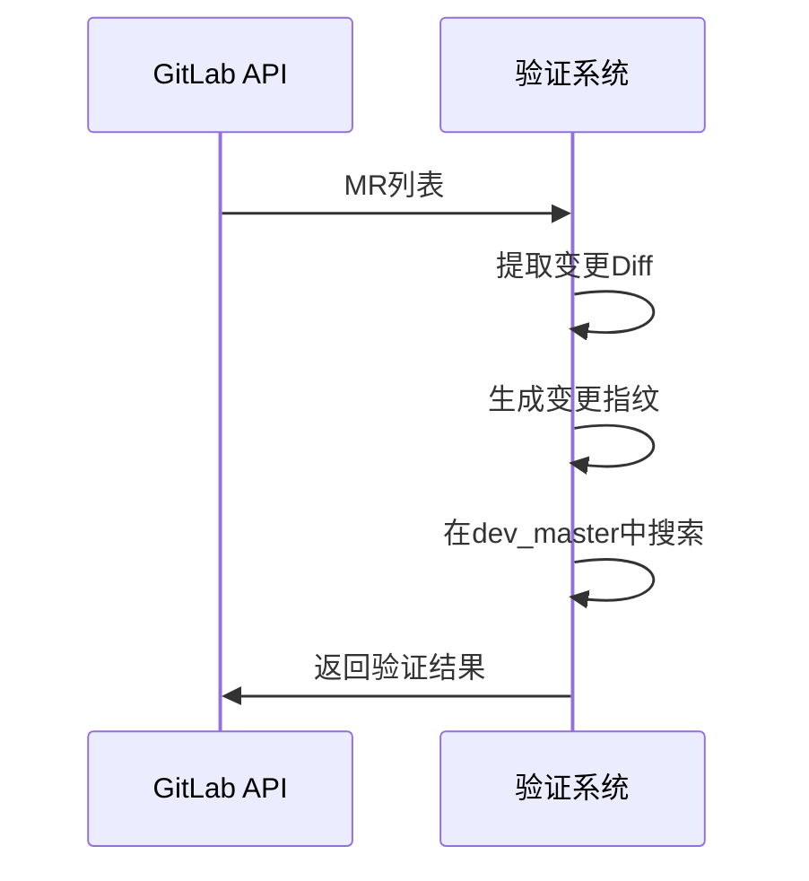
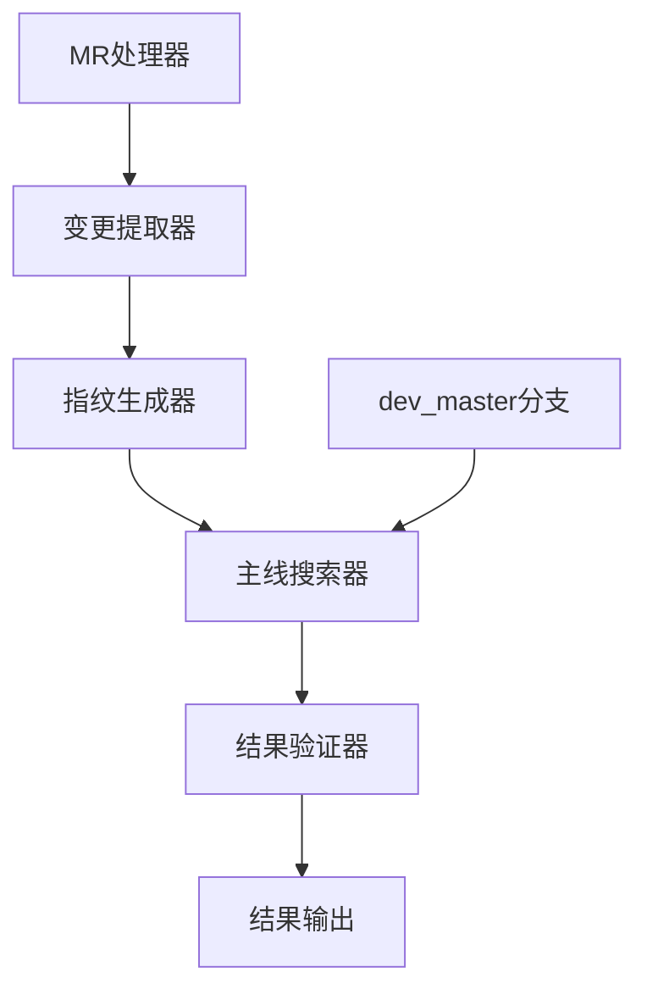

# 代码变更指纹验证简化方案

## 核心目标

**输入**：通过GitLab获取支线分支的MR列表  
**输出**：判断这些MR是否已进入主线分支 `dev_master`

## 工作流程



## 系统架构



## 核心组件

| 组件 | 功能描述 |
|------|----------|
| **MR处理器** | 从GitLab获取指定分支的MR列表 |
| **变更提取器** | 提取MR的代码变更（Diff） |
| **指纹生成器** | 生成变更内容的唯一指纹标识 |
| **主线搜索器** | 在dev_master分支中搜索匹配 |
| **结果验证器** | 生成最终验证结论 |
| **结果输出器** | 格式化输出验证结果 |

## 实现计划

- **开发周期**：1-2周
- **验证周期**：1周
- **核心风险**：Git操作的边界情况处理

## 文件结构

```
/examples/     # 使用示例和配置模板
/impl/         # 实现代码和详细文档
/docs/         # 扩展文档和API说明
```

---

**详细实现请参考**：
- 📁 `examples/` - 配置模板和使用示例
- 📁 `impl/` - 完整实现代码
- 📁 `docs/` - API文档和扩展说明
