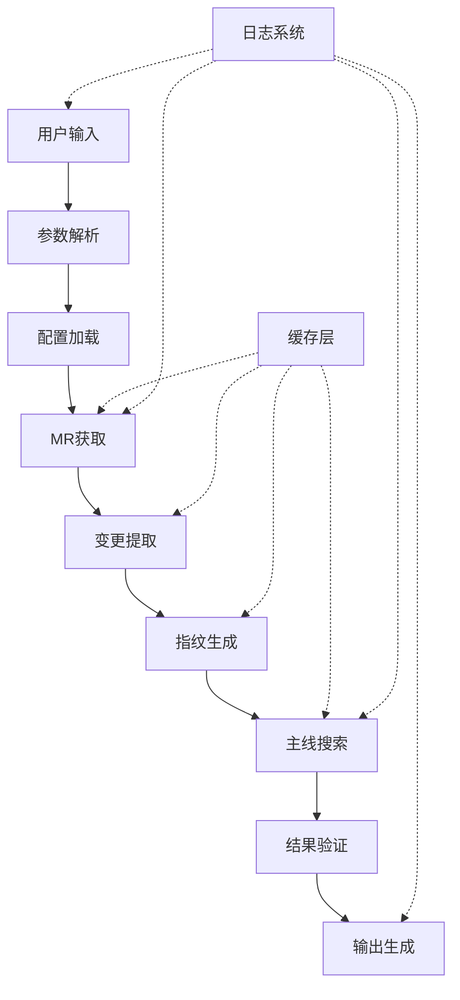

# 系统架构文档

本文档详细介绍 Core Reflow 的系统架构设计，帮助开发者理解系统的整体结构和各个组件的职责。

## 🏗️ 总体架构

### 架构概览

```
┌─────────────────────────────────────────────────────────────┐
│                     Core Reflow System                      │
├─────────────────────────────────────────────────────────────┤
│  🎯 CLI Layer                                               │
│  ├── main.py           (主入口点)                           │
│  └── cli.py            (命令行接口)                         │
├─────────────────────────────────────────────────────────────┤
│  🔧 Core Business Logic                                     │
│  ├── delivery_validator.py  (交付分支验证器)                │
│  ├── validator.py          (匹配验证器)                     │
│  └── outputer.py           (结果输出器)                     │
├─────────────────────────────────────────────────────────────┤
│  📡 External Integration                                    │
│  ├── gitlab_api/           (GitLab API 接口)               │
│  │   └── mr_processor.py   (MR 处理器)                     │
│  └── git_operations/       (Git 操作)                      │
│      ├── extractor.py      (变更提取器)                    │
│      └── searcher.py       (主线搜索器)                    │
├─────────────────────────────────────────────────────────────┤
│  🔍 Data Processing                                         │
│  └── fingerprint/          (指纹生成)                      │
│      └── generator.py      (指纹生成器)                    │
├─────────────────────────────────────────────────────────────┤
│  🛠️ Infrastructure                                          │
│  └── utils/                (工具模块)                      │
│      ├── cache.py          (缓存管理)                      │
│      ├── config.py         (配置管理)                      │
│      ├── parallel.py       (并行处理)                      │
│      ├── metrics.py        (性能指标)                      │
│      └── logging_config.py (日志配置)                      │
└─────────────────────────────────────────────────────────────┘
```

### 分层架构设计

#### 1. 表示层 (Presentation Layer)
- **主入口** (`main.py`): 提供核心验证功能的主要接口
- **CLI接口** (`cli.py`): 提供用户友好的命令行交互

#### 2. 业务逻辑层 (Business Logic Layer)
- **核心验证** (`core/`): 实现主要的验证逻辑
- **外部集成** (`gitlab_api/`, `git_operations/`): 处理外部系统交互
- **数据处理** (`fingerprint/`): 负责指纹生成和匹配

#### 3. 基础设施层 (Infrastructure Layer)
- **工具模块** (`utils/`): 提供缓存、配置、日志等基础功能

## 🔧 核心组件详解

### 1. MR 处理器 (MRProcessor)

```python
class MRProcessor:
    """GitLab MR 处理器"""
    
    def __init__(self, token, project_id, gitlab_url):
        self._gitlab = gitlab.Gitlab(gitlab_url, private_token=token)
        self.project_id = project_id
    
    def get_branch_mrs(self, branch_name: str) -> List[Dict]:
        """获取指定分支的所有已合并 MR"""
        
    def get_mr_by_id(self, mr_id: int) -> Dict:
        """根据 ID 获取 MR 详情"""
```

**职责**:
- GitLab API 调用封装
- MR 数据获取和预处理
- API 错误处理和重试

**设计模式**: 适配器模式 (Adapter Pattern)

### 2. 变更提取器 (ChangeExtractor)

```python
class ChangeExtractor:
    """Git 变更提取器"""
    
    def __init__(self, repo_path: str):
        self.repo = git.Repo(repo_path)
    
    def extract_changes(self, mr: Dict) -> List[Dict]:
        """从 MR 中提取代码变更"""
        
    def get_commit_diff(self, commit_sha: str) -> str:
        """获取提交的差异内容"""
```

**职责**:
- Git 仓库操作
- 提交差异提取
- 文件变更分析

**设计模式**: 外观模式 (Facade Pattern)

### 3. 指纹生成器 (FingerprintGenerator)

```python
class FingerprintGenerator:
    """代码指纹生成器"""
    
    def __init__(self, ignore_patterns: List[str]):
        self.ignore_patterns = ignore_patterns
    
    def generate(self, changes: List[Dict], mr_id: int) -> List[Dict]:
        """为变更生成指纹"""
        
    def generate_file_fingerprint(self, file_path: str, content: str) -> Dict:
        """为单个文件生成指纹"""
```

**职责**:
- 代码内容哈希计算
- 语义特征提取
- 指纹唯一性保证

**设计模式**: 策略模式 (Strategy Pattern)

### 4. 主线搜索器 (MasterBranchSearcher)

```python
class MasterBranchSearcher:
    """主线分支搜索器"""
    
    def __init__(self, repo_path: str, target_branch: str, 
                 cache_manager: CacheManager, ignore_patterns: List[str]):
        self.repo = git.Repo(repo_path)
        self.target_branch = target_branch
        self.cache_manager = cache_manager
    
    def search_changes_in_master(self, fingerprints: List[Dict], 
                                search_days: int) -> List[Dict]:
        """在主线分支中搜索变更"""
```

**职责**:
- 主线分支提交遍历
- 指纹匹配算法
- 搜索结果排序

**设计模式**: 模板方法模式 (Template Method Pattern)

### 5. 匹配验证器 (MatchValidator)

```python
class MatchValidator:
    """匹配结果验证器"""
    
    def validate_results(self, search_results: List[Dict]) -> List[Dict]:
        """验证搜索结果"""
        
    def calculate_confidence(self, match: Dict) -> float:
        """计算匹配置信度"""
```

**职责**:
- 匹配结果质量评估
- 置信度计算
- 误报过滤

**设计模式**: 责任链模式 (Chain of Responsibility)

## 📊 数据流设计

### 主要数据流



### 数据模型

#### MR 数据模型
```python
class MRData:
    id: int                    # MR ID
    iid: int                   # 项目内 ID
    title: str                 # 标题
    description: str           # 描述
    state: str                 # 状态
    source_branch: str         # 源分支
    target_branch: str         # 目标分支
    merge_commit_sha: str      # 合并提交SHA
    created_at: datetime       # 创建时间
    merged_at: datetime        # 合并时间
    author: UserData           # 作者信息
    changes: List[ChangeData]  # 变更列表
```

#### 变更数据模型
```python
class ChangeData:
    old_path: str              # 旧文件路径
    new_path: str              # 新文件路径
    diff: str                  # 差异内容
    added_lines: int           # 新增行数
    deleted_lines: int         # 删除行数
    file_type: str             # 文件类型
```

#### 指纹数据模型
```python
class FingerprintData:
    id: str                    # 指纹ID
    mr_id: int                 # 关联MR ID
    file_path: str             # 文件路径
    content_hash: str          # 内容哈希
    line_count: int            # 行数
    function_signatures: List[str]  # 函数签名
    class_names: List[str]     # 类名列表
    import_statements: List[str]    # 导入语句
    metadata: Dict             # 元数据
```

## 🔌 扩展点设计

### 1. 插件架构

```python
from abc import ABC, abstractmethod

class ValidatorPlugin(ABC):
    """验证器插件基类"""
    
    @abstractmethod
    def name(self) -> str:
        """插件名称"""
        pass
    
    @abstractmethod
    def validate(self, context: ValidationContext) -> ValidationResult:
        """执行验证"""
        pass

class PluginManager:
    """插件管理器"""
    
    def __init__(self):
        self._plugins: List[ValidatorPlugin] = []
    
    def register_plugin(self, plugin: ValidatorPlugin):
        """注册插件"""
        self._plugins.append(plugin)
    
    def execute_plugins(self, context: ValidationContext) -> List[ValidationResult]:
        """执行所有插件"""
        results = []
        for plugin in self._plugins:
            try:
                result = plugin.validate(context)
                results.append(result)
            except Exception as e:
                logger.error(f"Plugin {plugin.name()} failed: {e}")
        return results
```

### 2. 自定义指纹策略

```python
class FingerprintStrategy(ABC):
    """指纹生成策略接口"""
    
    @abstractmethod
    def generate_fingerprint(self, content: str, metadata: Dict) -> str:
        """生成指纹"""
        pass

class SHA256Strategy(FingerprintStrategy):
    """SHA256 哈希策略"""
    
    def generate_fingerprint(self, content: str, metadata: Dict) -> str:
        return hashlib.sha256(content.encode()).hexdigest()

class SemanticStrategy(FingerprintStrategy):
    """语义指纹策略"""
    
    def generate_fingerprint(self, content: str, metadata: Dict) -> str:
        # 提取语义特征
        features = self.extract_semantic_features(content)
        return self.hash_features(features)
```

### 3. 输出格式扩展

```python
class OutputFormatter(ABC):
    """输出格式化器接口"""
    
    @abstractmethod
    def format(self, results: List[ValidationResult]) -> str:
        """格式化输出"""
        pass

class JSONFormatter(OutputFormatter):
    """JSON 格式化器"""
    
    def format(self, results: List[ValidationResult]) -> str:
        return json.dumps([r.to_dict() for r in results], indent=2)

class HTMLFormatter(OutputFormatter):
    """HTML 格式化器"""
    
    def format(self, results: List[ValidationResult]) -> str:
        # 生成 HTML 报告
        pass
```

## ⚡ 性能优化设计

### 1. 多层缓存架构

```python
class CacheLayer:
    """缓存层抽象"""
    
    def __init__(self):
        self.l1_cache = MemoryCache()    # L1: 内存缓存
        self.l2_cache = FileCache()      # L2: 文件缓存
        self.l3_cache = RedisCache()     # L3: 分布式缓存
    
    def get(self, key: str) -> Any:
        # 从 L1 -> L2 -> L3 依次查找
        value = self.l1_cache.get(key)
        if value is not None:
            return value
            
        value = self.l2_cache.get(key)
        if value is not None:
            self.l1_cache.set(key, value)
            return value
            
        value = self.l3_cache.get(key)
        if value is not None:
            self.l1_cache.set(key, value)
            self.l2_cache.set(key, value)
            return value
        
        return None
```

### 2. 并行处理架构

```python
class ParallelProcessor:
    """并行处理器"""
    
    def __init__(self, max_workers: int):
        self.max_workers = max_workers
        self.executor = ThreadPoolExecutor(max_workers=max_workers)
    
    def process_batch(self, items: List[Any], 
                     processor_func: Callable,
                     batch_size: int = 10) -> List[Any]:
        """批量并行处理"""
        
        # 分批处理
        batches = [items[i:i+batch_size] 
                  for i in range(0, len(items), batch_size)]
        
        # 提交任务
        futures = []
        for batch in batches:
            future = self.executor.submit(self._process_batch, batch, processor_func)
            futures.append(future)
        
        # 收集结果
        results = []
        for future in as_completed(futures):
            batch_results = future.result()
            results.extend(batch_results)
        
        return results
```

### 3. 内存优化

```python
class MemoryOptimizer:
    """内存优化器"""
    
    def __init__(self):
        self.gc_threshold = 1000  # GC 触发阈值
        self.object_count = 0
    
    def process_with_gc(self, items: List[Any], processor_func: Callable):
        """带垃圾回收的处理"""
        results = []
        
        for item in items:
            result = processor_func(item)
            results.append(result)
            
            self.object_count += 1
            if self.object_count >= self.gc_threshold:
                gc.collect()
                self.object_count = 0
        
        return results
    
    @contextmanager
    def memory_monitor(self):
        """内存监控上下文"""
        start_memory = psutil.Process().memory_info().rss
        
        try:
            yield
        finally:
            end_memory = psutil.Process().memory_info().rss
            memory_used = end_memory - start_memory
            
            if memory_used > 100 * 1024 * 1024:  # 100MB
                logger.warning(f"High memory usage: {memory_used / 1024 / 1024:.1f}MB")
                gc.collect()
```

## 🛡️ 错误处理设计

### 异常层次结构

```python
class CoreReflowError(Exception):
    """Core Reflow 基础异常"""
    pass

class ConfigurationError(CoreReflowError):
    """配置错误"""
    pass

class GitLabAPIError(CoreReflowError):
    """GitLab API 错误"""
    
    def __init__(self, message: str, status_code: int = None, response: str = None):
        super().__init__(message)
        self.status_code = status_code
        self.response = response

class GitOperationError(CoreReflowError):
    """Git 操作错误"""
    pass

class ValidationError(CoreReflowError):
    """验证错误"""
    pass
```

### 错误处理策略

```python
class ErrorHandler:
    """错误处理器"""
    
    def __init__(self, logger):
        self.logger = logger
        self.retry_strategies = {
            GitLabAPIError: RetryStrategy(max_attempts=3, backoff=2.0),
            GitOperationError: RetryStrategy(max_attempts=2, backoff=1.0),
        }
    
    def handle_with_retry(self, func: Callable, *args, **kwargs):
        """带重试的错误处理"""
        last_exception = None
        
        for attempt in range(self.max_retries):
            try:
                return func(*args, **kwargs)
            except Exception as e:
                last_exception = e
                
                strategy = self.retry_strategies.get(type(e))
                if strategy and attempt < strategy.max_attempts - 1:
                    wait_time = strategy.backoff ** attempt
                    self.logger.warning(f"Attempt {attempt + 1} failed, retrying in {wait_time}s: {e}")
                    time.sleep(wait_time)
                else:
                    break
        
        raise last_exception
```

## 📝 日志和监控

### 结构化日志设计

```python
class StructuredLogger:
    """结构化日志器"""
    
    def __init__(self, name: str):
        self.logger = logging.getLogger(name)
        self.context = {}
    
    def with_context(self, **kwargs):
        """添加上下文信息"""
        new_logger = StructuredLogger(self.logger.name)
        new_logger.context = {**self.context, **kwargs}
        return new_logger
    
    def log_operation(self, operation: str, **kwargs):
        """记录操作日志"""
        context = {
            **self.context,
            'operation': operation,
            'timestamp': datetime.now().isoformat(),
            **kwargs
        }
        self.logger.info("Operation executed", extra={'context': context})
    
    def log_error(self, operation: str, error: Exception, **kwargs):
        """记录错误日志"""
        context = {
            **self.context,
            'operation': operation,
            'error_type': type(error).__name__,
            'error_message': str(error),
            'timestamp': datetime.now().isoformat(),
            **kwargs
        }
        self.logger.error("Operation failed", extra={'context': context})
```

### 指标收集

```python
class MetricsCollector:
    """指标收集器"""
    
    def __init__(self):
        self.counters = defaultdict(int)
        self.timers = defaultdict(list)
        self.gauges = {}
    
    def increment_counter(self, name: str, value: int = 1, tags: Dict = None):
        """递增计数器"""
        key = f"{name}:{self._format_tags(tags or {})}"
        self.counters[key] += value
    
    def record_timer(self, name: str, value: float, tags: Dict = None):
        """记录计时器"""
        key = f"{name}:{self._format_tags(tags or {})}"
        self.timers[key].append(value)
    
    def set_gauge(self, name: str, value: float, tags: Dict = None):
        """设置仪表"""
        key = f"{name}:{self._format_tags(tags or {})}"
        self.gauges[key] = value
    
    def get_summary(self) -> Dict:
        """获取指标摘要"""
        return {
            'counters': dict(self.counters),
            'timers': {k: {
                'count': len(v),
                'avg': sum(v) / len(v) if v else 0,
                'max': max(v) if v else 0,
                'min': min(v) if v else 0
            } for k, v in self.timers.items()},
            'gauges': dict(self.gauges)
        }
```

## 🚀 部署架构

### 单机部署

```yaml
# docker-compose.yml
version: '3.8'

services:
  core-reflow:
    build: .
    ports:
      - "8000:8000"
    environment:
      - GITLAB_TOKEN=${GITLAB_TOKEN}
      - GITLAB_URL=${GITLAB_URL}
    volumes:
      - ./config:/app/config
      - ./logs:/app/logs
      - ./cache:/app/cache
    restart: unless-stopped
```

### 分布式部署

```yaml
# kubernetes deployment
apiVersion: apps/v1
kind: Deployment
metadata:
  name: core-reflow-api
spec:
  replicas: 3
  selector:
    matchLabels:
      app: core-reflow-api
  template:
    metadata:
      labels:
        app: core-reflow-api
    spec:
      containers:
      - name: core-reflow
        image: core-reflow:latest
        ports:
        - containerPort: 8000
        env:
        - name: GITLAB_TOKEN
          valueFrom:
            secretKeyRef:
              name: gitlab-secret
              key: token
        resources:
          requests:
            memory: "512Mi"
            cpu: "250m"
          limits:
            memory: "1Gi"
            cpu: "500m"
```

这个架构设计文档为 Core Reflow 系统提供了全面的技术架构指导，帮助开发者理解系统设计理念和实现细节。
